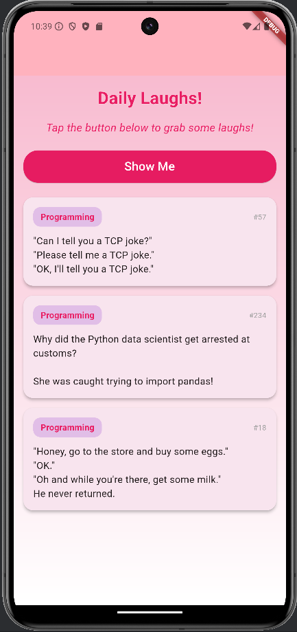

# Joke App

A fun Flutter app that fetches jokes from the JokeAPI and displays them in a stylish list format.

## Features

- Fetches jokes from JokeAPI.
- Displays jokes in a user-friendly list.
- Handles loading and error states.
- Beautiful Material 3 design with a pink color scheme.

## Requirements

- **Flutter**: `>=3.0.0 <4.0.0`
- A device or emulator to run the app.

### This project uses the following packages:

- flutter: >=3.0.0 <4.0.0 - Flutter SDK for building the app.
- dio: ^5.0.0 - A powerful HTTP client for making API requests.
- cupertino_icons: ^1.0.2 - Provides iOS-style icons for the app.
- flutter_lints: ^2.0.0 - Provides lint rules for maintaining code quality.

